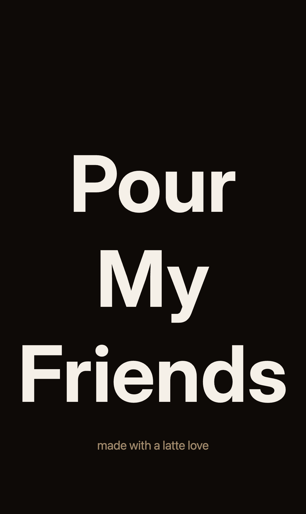
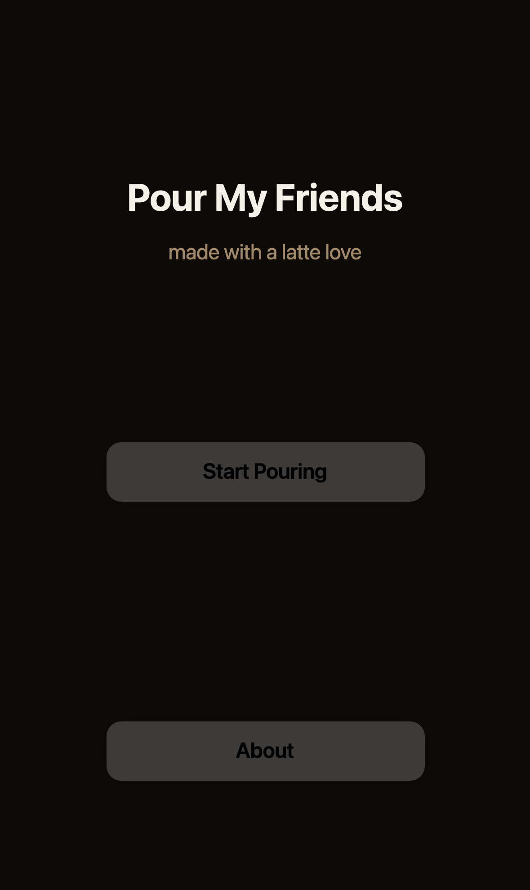
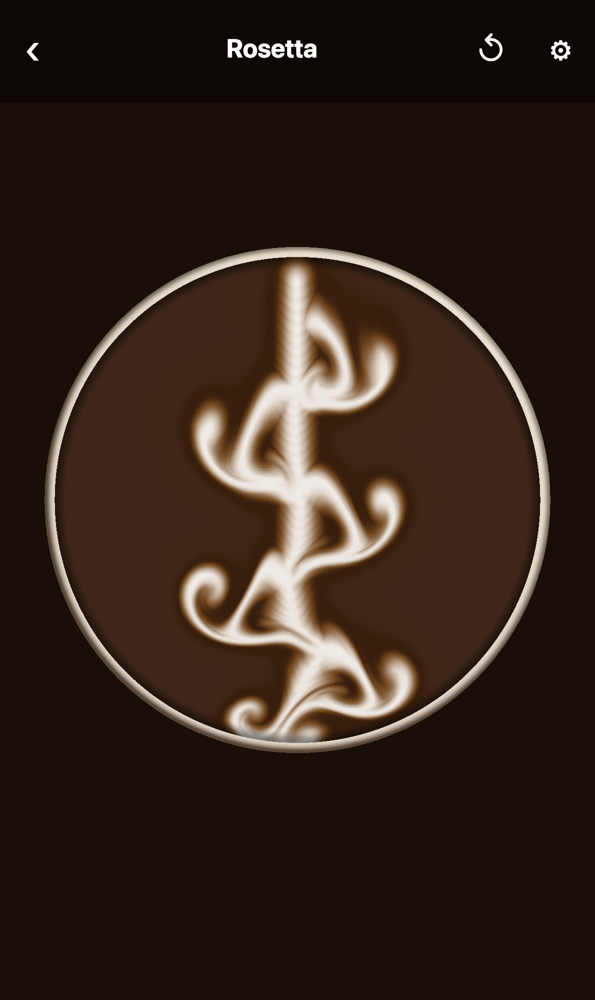
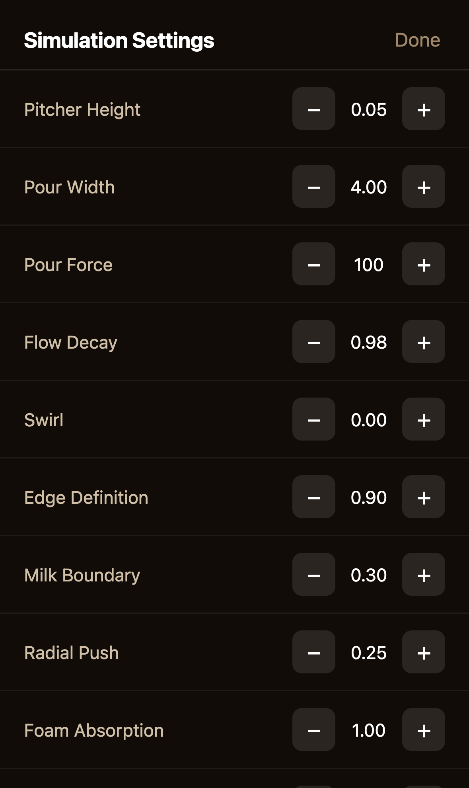
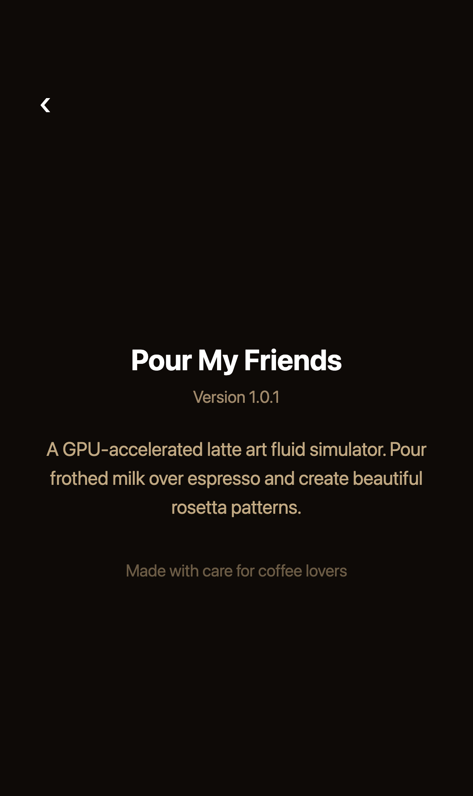

# Pour My Friends ☕️

Pour latte art with your finger.

Drag across the cup and milk streams into espresso, swirling into rosetta petals the way it
does from a real pitcher. There's no drawing tool underneath — it's an actual fluid simulation
running on the GPU, so the milk folds, spreads, and settles on its own. Tilt the pitcher,
widen the pour, add swirl, and the physics changes with it.

Built with Expo and React Native. Runs on iOS, Android, and the web.

<table>
  <tr>
    <td width="20%"></td>
    <td width="20%"></td>
    <td width="20%"></td>
    <td width="20%"></td>
    <td width="20%"></td>
  </tr>
  <tr>
    <td align="center"><sub>Splash</sub></td>
    <td align="center"><sub>Home</sub></td>
    <td align="center"><sub>Pouring</sub></td>
    <td align="center"><sub>Settings</sub></td>
    <td align="center"><sub>About</sub></td>
  </tr>
</table>

## Quick start

```sh
yarn                  # install dependencies
yarn env:development  # pull development environment variables from EAS
yarn web              # open http://localhost:8081 and start pouring
```

For iOS or Android, run `yarn prebuild` once, then `yarn ios` / `yarn android`. Full setup —
device tooling, EAS accounts, build profiles — is in [docs/DEVELOPMENT.md](docs/DEVELOPMENT.md).

## How it works

Every frame, your touch stamps velocity ("the push of the stream") and dye ("the milk") into
floating-point textures. A chain of shaders then makes the flow behave like a liquid — measure
the swirl, amplify it, solve for pressure so milk can't pile up in one spot, and carry
everything along the flow — before a final shader paints the cup: espresso underneath, milk on
top, with the shading that picks out petals and ridges.

The whole thing lives in `components/screens/Rosetta/`, with the GLSL in `shaders/` beside it.
[docs/ARCHITECTURE.md](docs/ARCHITECTURE.md) walks through the pipeline pass by pass.

## Layout

```
app/                  # Expo Router routes — one file per screen
components/
  screens/            # the screens themselves, incl. Rosetta + its shaders
  primitives/         # NativeWind-wrapped Text, View, Image, Button, MilkText
  providers/          # analytics capture provider
hooks/                # storage, theme, navigation, analytics hooks
lib/                  # colors, utilities, analytics models
scripts/              # screenshots.mjs — regenerates the images above
docs/                 # architecture, development, conventions
```

## Docs

- [Architecture](docs/ARCHITECTURE.md) — routes, the fluid pipeline, tuning knobs
- [Development](docs/DEVELOPMENT.md) — setup, env vars, builds, screenshots
- [Conventions](docs/CONVENTIONS.md) — TypeScript, React, styling, naming
- [AGENTS.md](AGENTS.md) — context for AI coding agents

## License

[MIT](LICENSE)
